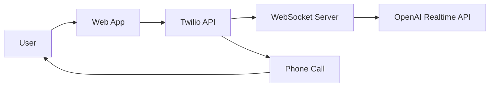

# AI Phone Screen Practice

[](https://coderabbit.ai/github/acedit-ai/phone-screen)

An open-source project to simulate job interview phone screens using OpenAI's Realtime API and Twilio. Practice your interviewing skills with an AI that calls you!


## 🚀 Quick Start

### Prerequisites
- Node.js 18+
- Twilio Account with phone numbers
- OpenAI API Key

### 3-Terminal Setup

```bash
# Terminal 1: Start ngrok
ngrok http 8081
# Copy the HTTPS URL (e.g., https://abc123.ngrok-free.app)

# Terminal 2: Start websocket server  
cd websocket-server
# Add ngrok URL to .env: PUBLIC_URL=https://abc123.ngrok-free.app
npm install && npm run dev

# Terminal 3: Start webapp
cd webapp  
# Add ngrok URL to .env.local: NEXT_PUBLIC_WEBSOCKET_SERVER_URL=https://abc123.ngrok-free.app
npm install && npm run dev
```

Open `http://localhost:3000` and start practicing!

**⚠️ Important:** Both components need the **same ngrok HTTPS URL** in their environment files.

## 🌍 Supported Regions

| Region | Flag | Country Code | Status |
|--------|------|--------------|---------|
| United States | 🇺🇸 | +1 | Required (fallback) |
| Australia | 🇦🇺 | +61 | Optional |
| India | 🇮🇳 | +91 | Optional |

**Smart Fallback**: If regional numbers aren't configured, the system automatically uses the US number.

## 📋 Architecture



**Components:**
- **Web App** (Next.js): Call configuration, transcripts, and UI
- **WebSocket Server** (Express): Handles Twilio ↔ OpenAI communication

## ✨ Key Features

✅ **Real-time AI Conversations** - Natural voice interactions using OpenAI Realtime API  
✅ **Multi-Region Support** - US, Australia, India with automatic fallback  
✅ **Rate Limiting** - Built-in abuse protection with graceful messaging  
✅ **Security** - Optional Cloudflare Turnstile bot protection  
✅ **Session Management** - Proper state handling between calls  
✅ **Database Integration** - Persistent storage with PostgreSQL  
✅ **PR Previews** - Automatic deployment for every pull request  

## 📚 Complete Documentation

For detailed setup, configuration, and deployment instructions, visit our comprehensive documentation:

**🔗 [View Documentation](https://phone-screen.acedit.ai/documentation/)**

### Quick Links

- **[Environment Setup Guide](https://phone-screen.acedit.ai/documentation/getting-started/environment-setup)** - Complete configuration walkthrough
- **[Architecture Guide](https://phone-screen.acedit.ai/documentation/architecture/session-management)** - How the system works  
- **[Deployment Guide](https://phone-screen.acedit.ai/documentation/deployment)** - Production deployment
- **[Troubleshooting](https://phone-screen.acedit.ai/documentation/troubleshooting)** - Common issues and solutions

## 🛠️ Development

### Environment Files Needed

Create these files with your API keys and configuration:

- `webapp/.env.local` - Twilio credentials, database URL, verification keys
- `websocket-server/.env` - OpenAI API key, rate limiting config

See the [Environment Setup Guide](https://phone-screen.acedit.ai/documentation/getting-started/environment-setup) for complete details.

### Contributing

We welcome contributions! Please see our [Development Workflow](https://phone-screen.acedit.ai/documentation/development/workflow) for:

- Branch strategy and commit conventions
- Code quality standards and testing  
- PR review process
- Best practices

## 🚀 Deployment Options

### Automatic (Recommended)
- **WebSocket Server**: Automatically deploys to Fly.io on push to `main`
- **Web App**: Deploy to Vercel with GitHub integration
- **PR Previews**: Every PR gets its own preview environment

### Manual
```bash
# WebSocket Server (Fly.io)
cd websocket-server && fly deploy

# Web App (Vercel)  
cd webapp && vercel --prod
```

See the [Deployment Guide](https://phone-screen.acedit.ai/documentation/deployment) for complete setup instructions.

## 🆘 Getting Help

- **[Documentation](https://phone-screen.acedit.ai/documentation/)** - Comprehensive guides and tutorials
- **[GitHub Issues](https://github.com/acedit-ai/phone-screen/issues)** - Bug reports and feature requests
- **[GitHub Discussions](https://github.com/acedit-ai/phone-screen/discussions)** - Community support and questions

## 📄 License

This project is licensed under the MIT License - see the [LICENSE](LICENSE) file for details.

---

**Note**: This is a starter project for educational purposes. Please review security practices and audit the code before deploying to production.
