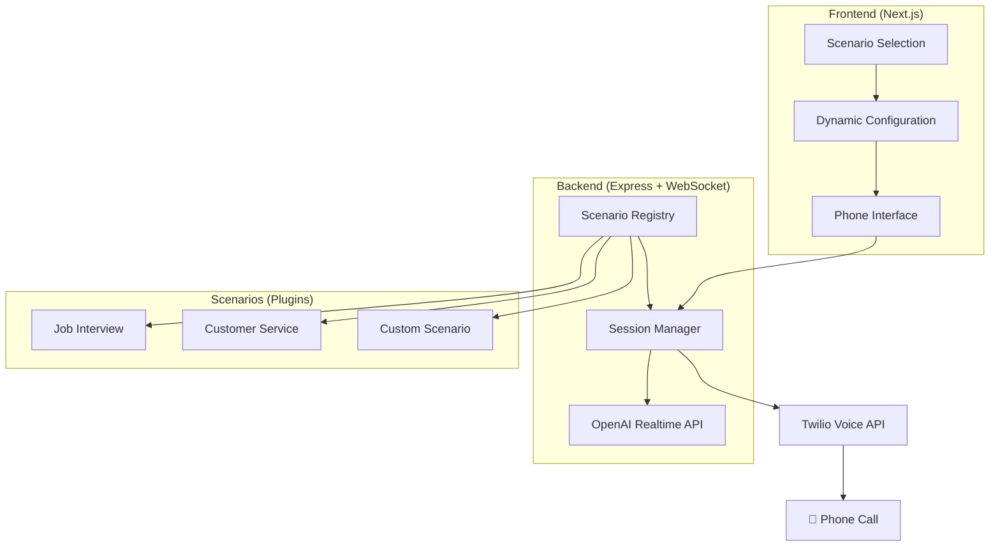

# AI-Powered Call Practice System

[](https://coderabbit.ai/github/acedit-ai/phone-screen)

A **modular, domain-agnostic** platform for AI-powered phone call simulations. Built with a plugin architecture that makes it easy to create custom call scenarios - from job interviews to customer service training and beyond.

> **🌟 Built on OpenAI's Foundation**: This project extends and enhances the [OpenAI Realtime Twilio Demo](https://github.com/openai/openai-realtime-twilio-demo) with **outbound calling capabilities**, a production-ready plugin architecture, comprehensive documentation, and enterprise features.


## 🎯 What Makes This Special

**🔌 Plugin Architecture**: Easily create new call scenarios without touching core code  
**🌍 Domain Agnostic**: Not just job interviews - build any type of call simulation  
**🚀 Production Ready**: Rate limiting, security, multi-region support built-in  
**📱 Real Phone Calls**: Uses Twilio + OpenAI Realtime API for authentic experiences  

## 🎭 Built-in Scenarios

- **💼 Job Interview Practice** - Realistic interview simulations for any role
- **📞 Customer Service Training** - Practice handling customer inquiries
- **🏥 Medical Consultation** - Healthcare communication training
- **🎓 Language Learning** - Conversational practice in different languages

**Want more?** Creating new scenarios takes just minutes with our plugin system!

## 🚀 Quick Start

### Prerequisites
- Node.js 18+
- Twilio Account with phone numbers
- OpenAI API Key

### 3-Terminal Setup

```bash
# Terminal 1: Start ngrok
ngrok http 8081
# Copy the HTTPS URL (e.g., https://abc123.ngrok-free.app)

# Terminal 2: Start websocket server  
cd websocket-server
# Add ngrok URL to .env: PUBLIC_URL=https://abc123.ngrok-free.app
npm install && npm run dev

# Terminal 3: Start webapp
cd webapp  
# Add ngrok URL to .env.local: NEXT_PUBLIC_WEBSOCKET_SERVER_URL=https://abc123.ngrok-free.app
npm install && npm run dev
```

Open `http://localhost:3000` and start practicing!

**⚠️ Important:** Both components need the **same ngrok HTTPS URL** in their environment files.

## 🏗️ Architecture Overview



**Key Components:**
- **Scenario System**: Plugin-based architecture for different call types
- **Dynamic Frontend**: Adapts UI based on selected scenario
- **Session Management**: Handles state and configuration per call
- **Multi-Region Support**: US, Australia, India with automatic fallback

## ✨ Key Features

✅ **Plugin Architecture** - Add new scenarios without touching core code  
✅ **Dynamic UI** - Frontend adapts to any scenario automatically  
✅ **Real-time AI Conversations** - Natural voice interactions using OpenAI Realtime API  
✅ **Multi-Region Support** - US, Australia, India with automatic fallback  
✅ **Rate Limiting** - Built-in abuse protection with graceful messaging  
✅ **Security** - Optional Cloudflare Turnstile bot protection  
✅ **Session Management** - Proper state handling between calls  
✅ **Database Integration** - Persistent storage with PostgreSQL  
✅ **Type Safety** - Full TypeScript support throughout  

## 🔌 Creating Custom Scenarios

Building a new scenario is simple! Here's a minimal example:

```typescript
// websocket-server/src/scenarios/my-scenario.ts
import { CallScenario } from './types';

export const myScenario: CallScenario = {
  id: 'my-scenario',
  name: 'My Custom Scenario',
  description: 'A custom call scenario',
  schema: {
    fields: [
      {
        key: 'topic',
        label: 'Discussion Topic',
        type: 'text',
        required: true,
        placeholder: 'What should we talk about?'
      }
    ],
    voiceOptions: [
      { value: 'ash', label: 'Ashley', description: 'Professional tone' }
    ]
  },
  
  generateInstructions: (config) => 
    `You are discussing ${config.topic}. Be helpful and engaging.`,
    
  generateGreeting: (config) => 
    `Hello! I'm excited to discuss ${config.topic} with you today.`
};
```

Then register it in `scenarios/index.ts` and you're done! The frontend will automatically detect and display your new scenario.

## 🌍 Supported Regions

| Region | Flag | Country Code | Status |
|--------|------|--------------|---------|
| United States | 🇺🇸 | +1 | Required (fallback) |
| Australia | 🇦🇺 | +61 | Optional |
| India | 🇮🇳 | +91 | Optional |

**Smart Fallback**: If regional numbers aren't configured, the system automatically uses the US number.

## 📚 Complete Documentation

For detailed setup, configuration, and development guides:

**🔗 [View Documentation](https://phone-screen.acedit.ai/documentation/)**

### Quick Links

- **[Scenario Development Guide](https://phone-screen.acedit.ai/documentation/scenarios/creating-scenarios)** - Build custom scenarios
- **[Environment Setup Guide](https://phone-screen.acedit.ai/documentation/getting-started/environment-setup)** - Complete configuration
- **[Architecture Guide](https://phone-screen.acedit.ai/documentation/architecture/scenario-system)** - How the plugin system works  
- **[Deployment Guide](https://phone-screen.acedit.ai/documentation/deployment)** - Production deployment
- **[API Reference](https://phone-screen.acedit.ai/documentation/api/scenario-api)** - Complete API documentation

## 🛠️ Development

### Environment Files Needed

Create these files with your API keys and configuration:

- `webapp/.env.local` - Twilio credentials, database URL, verification keys
- `websocket-server/.env` - OpenAI API key, rate limiting config

See the [Environment Setup Guide](https://phone-screen.acedit.ai/documentation/getting-started/environment-setup) for complete details.

### Contributing

We welcome contributions! Please see our [Development Workflow](https://phone-screen.acedit.ai/documentation/development/workflow) for:

- Branch strategy and commit conventions
- Code quality standards and testing  
- PR review process
- Scenario development guidelines

## 🚀 Deployment Options

### Automatic (Recommended)
- **WebSocket Server**: Automatically deploys to Fly.io on push to `main`
- **Web App**: Deploy to Vercel with GitHub integration
- **PR Previews**: Every PR gets its own preview environment

### Manual
```bash
# WebSocket Server (Fly.io)
cd websocket-server && fly deploy

# Web App (Vercel)  
cd webapp && vercel --prod
```

See the [Deployment Guide](https://phone-screen.acedit.ai/documentation/deployment) for complete setup instructions.

## 🆘 Getting Help

- **[Documentation](https://phone-screen.acedit.ai/documentation/)** - Comprehensive guides and tutorials
- **[GitHub Issues](https://github.com/acedit-ai/phone-screen/issues)** - Bug reports and feature requests
- **[GitHub Discussions](https://github.com/acedit-ai/phone-screen/discussions)** - Community support and questions

## 📄 License

This project is licensed under the MIT License - see the [LICENSE](LICENSE) file for details.

---

**Note**: This is a starter project designed to be extended. The modular architecture makes it easy to adapt for your specific use case while maintaining production-ready features.
