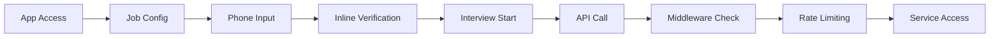

# Security & Bot Protection

This document describes the comprehensive security implementation using Cloudflare Turnstile to protect the free AI calling service from automated abuse.

## 🛡️ Overview

The security system provides **inline verification** within the call interface that enables the start interview button once completed, ensuring legitimate users while preventing automated abuse.

## 🎯 Security Goals

- ✅ **Contextual Bot Protection**: Users verify when they're ready to start their interview
- ✅ **Non-blocking UX**: Users can configure job details before verification
- ✅ **Progressive Interface**: Verification appears after phone number entry
- ✅ **Session Management**: 30-minute verification tokens stored in session storage
- ✅ **API Protection**: All API routes protected by middleware requiring valid tokens
- ✅ **Development Friendly**: Graceful fallbacks when Turnstile isn't configured
- ✅ **Production Ready**: Comprehensive error handling and monitoring

## 🏗️ Architecture

### User Flow


### Security Layers

1. **Frontend Verification**: Cloudflare Turnstile widget integration
2. **Session Tokens**: 30-minute expiry with automatic cleanup
3. **API Middleware**: Server-side token validation
4. **Rate Limiting**: Additional protection against abuse
5. **Database Persistence**: Rate limits survive server restarts

## 🔐 Implementation Details

### Progressive UI Flow

**Phase 1: Job Configuration**
- Users fill out job title, company, description
- No verification required for configuration

**Phase 2: Phone Entry**
- Phone input becomes available after job config
- Regional validation and phone number formatting

**Phase 3: Verification**
- Turnstile challenge appears in contained section
- Visual feedback for verification progress
- Success state with confirmation

**Phase 4: Interview Ready**
- Start interview button becomes enabled
- Clear visual indication everything is ready

### Verification Interface

```typescript
// Unverified state
<div className="bg-gray-50 border border-gray-200 rounded-lg p-4 space-y-3">
  <p className="text-xs text-gray-600">
    To protect our free service and ensure quality for everyone, 
    please complete this quick verification.
  </p>
  <Turnstile siteKey={siteKey} onSuccess={handleSuccess} />
  <p className="text-xs text-gray-500 text-center">🔒 Protected by Cloudflare</p>
</div>

// Verified state
<div className="bg-green-50 border border-green-200 rounded-lg p-3">
  <div className="flex items-center gap-2">
    <Shield className="h-4 w-4 text-green-600" />
    <span className="text-sm text-green-700 font-medium">Verification Complete</span>
  </div>
  <p className="text-xs text-green-600 mt-1">
    You're all set! Click below to start your interview.
  </p>
</div>
```

### Button State Management

**Dynamic Button Text**:
- "Enter Valid Phone Number" - Invalid/missing phone
- "Complete Verification to Start" - Valid phone, pending verification  
- "Start Interview Call" - Ready to proceed

**Visual Indicators**:
- Disabled state with opacity and cursor styling
- Progress indicators for loading states
- Success badges for completed verification

## 🔒 Token Management

### Storage & Lifecycle
- **Storage**: Session storage (cleared on browser close)
- **Expiry**: 30 minutes from verification
- **Validation**: Server-side verification with Cloudflare
- **Cleanup**: Automatic removal of expired tokens

### Token Flow
```typescript
// Frontend: Store token after successful verification
const handleTurnstileSuccess = async (token: string) => {
  sessionStorage.setItem('turnstile_verification', token);
  sessionStorage.setItem('turnstile_timestamp', Date.now().toString());
  setIsVerified(true);
};

// Backend: Validate token on API requests
const isValidToken = await verifyTurnstileToken(token);
if (!isValidToken) {
  return res.status(403).json({ error: 'Invalid verification token' });
}
```

## 🚦 Environment-Based Behavior

### Development Mode
- **Auto-bypass**: `NODE_ENV=development` automatically bypasses verification
- **Console logging**: Shows "🔓 Verification bypassed: development mode"
- **No configuration needed**: Works without Turnstile keys

### Disabled Mode (Default)
- **Setting**: `NEXT_PUBLIC_TURNSTILE_ENABLED=false` or not set
- **Behavior**: Verification completely bypassed
- **UI**: Shows configuration message instead of widget

### Production Mode
- **Setting**: `NEXT_PUBLIC_TURNSTILE_ENABLED=true`
- **Requirements**: Valid site key and secret key required
- **Full verification**: Complete Turnstile challenge required

## 🌐 API Protection

### Middleware Implementation

All API routes except verification are protected:

```typescript
// Middleware checks for valid tokens
export function middleware(request: NextRequest) {
  const token = request.headers.get('X-Turnstile-Token') || 
                request.cookies.get('turnstile_token')?.value;
  
  if (!token) {
    return new Response('Verification required', { status: 403 });
  }
  
  // Validate token with Cloudflare
  const isValid = await verifyTurnstileToken(token);
  if (!isValid) {
    return new Response('Invalid verification token', { status: 403 });
  }
}
```

### Protected Endpoints
- `POST /api/call/outbound` - Start outbound calls
- All API routes requiring user actions
- WebSocket endpoints (optional)

## 📊 Monitoring & Analytics

### Frontend Logging
```javascript
// Verification events
console.log('✅ Verification successful');
console.error('Verification error:', error);
console.log('Button enabled - phone and verification complete');
```

### Backend Logging
```javascript
// API access events
console.log('✅ API access granted with verification token');
console.warn('🚫 API access denied - no verification token');
console.log('🔍 Verifying token for endpoint from IP');
```

### Cloudflare Analytics
- Challenge completion rates
- Bot detection effectiveness
- Geographic usage patterns
- Security threat insights

## ⚙️ Configuration

### Environment Variables

**Required for Production**:
```bash
# Enable Turnstile
NEXT_PUBLIC_TURNSTILE_ENABLED=true

# Cloudflare keys
NEXT_PUBLIC_TURNSTILE_SITE_KEY=0x4AAAAAAA...
TURNSTILE_SECRET_KEY=0x4AAAAAAA...
```

**Development (Optional)**:
```bash
# Disabled by default
NEXT_PUBLIC_TURNSTILE_ENABLED=false
```

### Cloudflare Setup

1. **Get Turnstile Keys**:
   - Go to [Cloudflare Dashboard](https://dash.cloudflare.com/)
   - Navigate to "Turnstile"
   - Create new site
   - Configure domains (include `localhost` for development)

2. **Domain Configuration**:
   - **Development**: Add `localhost:3000`
   - **Production**: Add your production domain
   - **Testing**: Add ngrok domains if using

## 🧪 Testing

### Development Testing
1. **Without Turnstile**: Shows configuration message
2. **With Turnstile**: Full inline verification flow
3. **Phone Validation**: Test valid/invalid numbers
4. **Button States**: Verify enabling/disabling logic
5. **Token Expiry**: Test 30-minute expiration

### Production Testing
1. **Complete Flow**: Job config → Phone → Verification → Interview
2. **Token Persistence**: Verify session storage works
3. **API Access**: Confirm protected endpoints work
4. **Error Handling**: Test network failures and invalid tokens

## 🔧 Troubleshooting

### Common Issues

**"Verification is not configured"**
- Check `NEXT_PUBLIC_TURNSTILE_SITE_KEY` in environment
- Restart development server after adding variables
- Verify environment file location

**Start button not enabling**
- Verify phone number is valid and from supported region
- Check Turnstile verification completed successfully
- Look for verification success in browser console
- Check session storage for verification token

**"Verification failed"**
- Check `TURNSTILE_SECRET_KEY` on server
- Verify domain configured in Cloudflare
- Check network connectivity to Cloudflare
- Review browser network tab for API failures

### Debug Steps

1. **Check Button State**:
   ```javascript
   console.log('Phone valid:', isValidPhone);
   console.log('Region supported:', isSupportedRegion);
   console.log('Verified:', isVerified);
   ```

2. **Verify Session Storage**:
   ```javascript
   console.log(sessionStorage.getItem('turnstile_verification'));
   console.log(sessionStorage.getItem('turnstile_timestamp'));
   ```

3. **Check API Headers**:
   - Verify `X-Turnstile-Token` header in network requests

## 📈 Performance Impact

### Frontend
- **Bundle Size**: +15KB (React Turnstile component)
- **Load Time**: +200ms (Cloudflare script loading)
- **Memory**: Minimal impact from session storage
- **UX**: Non-blocking - users configure while verification loads

### Backend
- **API Latency**: +50ms (verification check per request)
- **Memory**: Minimal (no server-side storage)
- **Network**: 1 Cloudflare API call per verification

## 🔮 Future Enhancements

### UX Improvements
- **Smart Verification**: Only show for suspicious patterns
- **Regional Challenges**: Different challenge types by region
- **Accessibility**: Screen reader and keyboard navigation
- **Mobile Optimization**: Touch-optimized challenges

### Security Enhancements
- **Risk-based Verification**: Adjust difficulty based on risk
- **Multi-factor Options**: SMS/email for high-risk users
- **Device Fingerprinting**: Additional verification signals
- **Integration**: Coordinate with existing rate limiting

The security system provides comprehensive protection while maintaining excellent user experience through contextual, progressive verification that doesn't interfere with the core workflow. 