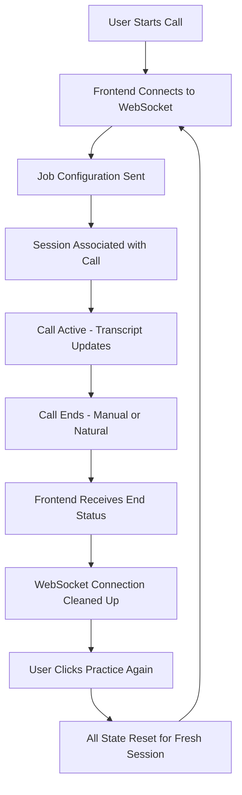

# Session Management & WebSocket Connection Handling

This document explains the improved session management system that ensures proper state handling between practice sessions.

## 🔍 Problem Solved

The previous implementation had issues where:
- **Stale WebSocket connections** persisted between sessions
- **Job configuration state** wasn't properly reset when starting new sessions
- **Call end detection** wasn't reliable, leading to orphaned connections
- **Frontend state** could become inconsistent with websocket server state

## ✅ Solution Overview

### **Frontend Improvements**

1. **Proper Connection Cleanup**
   ```typescript
   const handlePracticeAgain = () => {
     // Clean up any existing websocket connection
     if (ws) {
       console.log("Cleaning up existing websocket connection");
       ws.close();
       setWs(null);
     }
     
     // Reset all state for a fresh session
     setCallStatus("idle");
     setItems([]);
     setCurrentCallSid(null);
   };
   ```

2. **Component Unmount Cleanup**
   ```typescript
   useEffect(() => {
     return () => {
       if (ws) {
         console.log("Component unmounting - cleaning up websocket");
         ws.close();
       }
       if (timerRef.current) {
         clearTimeout(timerRef.current);
       }
     };
   }, [ws]);
   ```

3. **Improved Job Configuration Handling**
   - Immediate job config send when websocket opens
   - Retry mechanism for session association delays
   - Better logging for debugging

### **WebSocket Server Improvements**

1. **Better Call End Detection**
   ```typescript
   // Notify frontend before cleanup
   if (session.frontendConn && isOpen(session.frontendConn)) {
     const endMessage = {
       type: "call.status_changed",
       status: "ended",
       sessionId: session.id,
       streamSid: session.streamSid,
     };
     jsonSend(session.frontendConn, endMessage);
   }
   ```

2. **Session Reset Function**
   ```typescript
   export function resetAllSessions() {
     // Clean up all active sessions and connections
     // Clear waiting frontend connections
     // Ensure fresh state for new sessions
   }
   ```

3. **Enhanced Error Handling**
   - Frontend connection error handling
   - Better logging for debugging
   - Graceful cleanup on unexpected disconnections

## 🧪 Testing

### **Manual Testing**
1. Start a practice session with job configuration
2. Complete or end the call
3. Click "Practice Again" 
4. Verify job configuration is sent properly to new session
5. Verify no stale websocket connections remain

### **Automated Testing**
```bash
npm run test:session-cleanup
```

This script tests:
- Multiple frontend connection cycles
- Rapid connect/disconnect scenarios  
- Job configuration persistence
- Connection cleanup verification

## 🔧 Debugging

### **Frontend Debug Logs**
```javascript
// These logs help track websocket lifecycle
"Connecting to logs websocket: ws://localhost:8081/logs"
"Job configuration ready: {...}"
"Sending initial job configuration: {...}"
"Call ended detected from websocket"
"Cleaning up existing websocket connection"
```

### **WebSocket Server Debug Logs**  
```javascript
// These logs help track session management
"🖥️ Setting up frontend connection for logs"
"📋 Received job configuration for session..."
"🔄 Updating existing OpenAI session with new job configuration"
"📤 Sending call ended notification to frontend"
"🧹 Cleaning up frontend connection for session"
```

## 📊 State Flow Diagram



## 🎯 Best Practices

1. **Always close websocket connections** when starting new sessions
2. **Clear component state completely** before new sessions  
3. **Use proper error handlers** for websocket events
4. **Implement cleanup in component unmount** to prevent memory leaks
5. **Send job configuration immediately** when websocket opens
6. **Include retry mechanisms** for timing-sensitive operations

## 🚨 Common Issues & Solutions

### **Issue: Job configuration not received by AI**
**Solution**: Check frontend logs for job config send messages and websocket server logs for receipt confirmation.

### **Issue: Call doesn't end properly**
**Solution**: Check for call end status messages in websocket logs and ensure frontend receives the status change.

### **Issue: Stale connections affecting new sessions** 
**Solution**: Verify "Practice Again" button properly calls cleanup function and resets all state.

### **Issue: WebSocket connection fails**
**Solution**: Check `NEXT_PUBLIC_WEBSOCKET_SERVER_URL` environment variable and network connectivity.

## 🔮 Future Improvements

- **Connection pooling** for better resource management
- **Heartbeat mechanisms** to detect stale connections
- **Automatic reconnection** with exponential backoff
- **Session persistence** across page refreshes (if desired)
- **Rate limiting** for connection establishment 