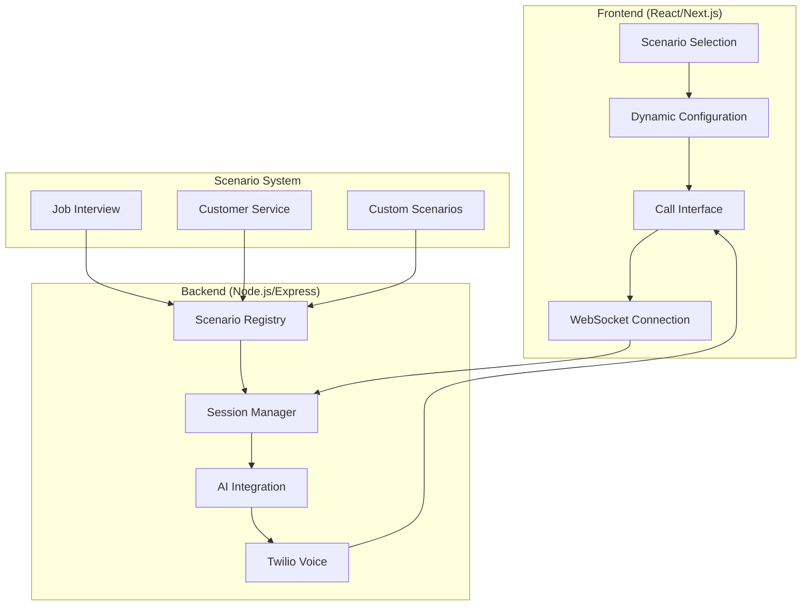

# Developer Guide

Complete guide for developers working with the AI-Powered Call Practice System.

## 🎯 Overview

This system has been transformed from a job interview-specific tool into a **modular, domain-agnostic platform** for AI-powered call simulations. The new architecture uses a plugin-based scenario system that makes it easy to create custom call experiences for any domain.

### Key Architectural Changes

- **Plugin Architecture**: Scenarios are self-contained modules
- **Dynamic Frontend**: UI adapts automatically to any scenario
- **Type Safety**: Full TypeScript support throughout
- **Backward Compatibility**: Legacy job interview functionality preserved
- **Extensible Design**: Add new scenarios without touching core code

## 🏗️ System Architecture



### Core Components

1. **Scenario Registry**: Central hub for managing all scenarios
2. **Dynamic UI**: React components that adapt to scenario schemas
3. **Session Manager**: Handles call lifecycle with scenario context
4. **WebSocket Server**: Real-time communication between frontend and backend
5. **AI Integration**: Generates scenario-specific instructions and responses

## 🚀 Quick Start

### Prerequisites

- Node.js 18+ and npm
- Twilio account with phone number
- OpenAI API key
- Basic understanding of TypeScript/React

### Installation

1. **Clone and install dependencies:**
   ```bash
   git clone <repository-url>
   cd phone-screen
   
   # Install backend dependencies
   cd websocket-server
   npm install
   
   # Install frontend dependencies
   cd ../webapp
   npm install
   ```

2. **Configure environment variables:**
   ```bash
   # websocket-server/.env
   TWILIO_ACCOUNT_SID=your_twilio_account_sid
   TWILIO_AUTH_TOKEN=your_twilio_auth_token
   TWILIO_PHONE_NUMBER=your_twilio_phone_number
   OPENAI_API_KEY=your_openai_api_key
   PORT=8081
   
   # webapp/.env.local
   NEXT_PUBLIC_WS_URL=ws://localhost:8081
   ```

3. **Start development servers:**
   ```bash
   # Terminal 1: Backend
   cd websocket-server
   npm run dev
   
   # Terminal 2: Frontend
   cd webapp
   npm run dev
   ```

4. **Access the application:**
   - Frontend: http://localhost:3000
   - Backend API: http://localhost:8081

## 📁 Project Structure

```
phone-screen/
├── websocket-server/           # Backend Node.js server
│   ├── src/
│   │   ├── scenarios/          # Scenario system
│   │   │   ├── types.ts        # Type definitions
│   │   │   ├── registry.ts     # Scenario registry
│   │   │   ├── index.ts        # Initialization
│   │   │   ├── job-interview.ts # Built-in scenario
│   │   │   └── customer-service.ts # Built-in scenario
│   │   ├── sessionManager.ts   # Call session management
│   │   ├── server.ts          # Express server setup
│   │   └── types.ts           # Core type definitions
│   └── package.json
├── webapp/                     # Frontend React/Next.js app
│   ├── components/
│   │   ├── scenario-configuration.tsx # Dynamic scenario UI
│   │   └── call-interface.tsx  # Main call interface
│   ├── lib/
│   │   └── scenario-service.ts # Scenario API client
│   └── package.json
└── documentation/              # Comprehensive documentation
    └── docs/
        ├── scenarios/          # Scenario system docs
        └── developer-guide.md  # This file
```

## 🔌 Creating Your First Scenario

Let's create a simple "Customer Support Training" scenario step by step.

### Step 1: Define the Scenario

Create `websocket-server/src/scenarios/customer-support.ts`:

```typescript
import { CallScenario } from './types';

export const customerSupportScenario: CallScenario = {
  id: 'customer-support',
  name: 'Customer Support Training',
  description: 'Practice handling customer support calls',
  icon: '🎧',
  
  schema: {
    id: 'customer-support',
    name: 'Customer Support Training',
    description: 'Practice handling customer support calls',
    icon: '🎧',
    fields: [
      {
        key: 'issueType',
        label: 'Issue Type',
        type: 'select',
        required: true,
        options: [
          { value: 'billing', label: 'Billing Issue' },
          { value: 'technical', label: 'Technical Problem' },
          { value: 'product', label: 'Product Question' },
          { value: 'complaint', label: 'Complaint' }
        ]
      },
      {
        key: 'customerMood',
        label: 'Customer Mood',
        type: 'select',
        required: true,
        options: [
          { value: 'calm', label: 'Calm and Patient' },
          { value: 'frustrated', label: 'Frustrated' },
          { value: 'angry', label: 'Angry' },
          { value: 'confused', label: 'Confused' }
        ]
      },
      {
        key: 'companyName',
        label: 'Company Name',
        type: 'text',
        required: true,
        placeholder: 'e.g., TechCorp, ServicePro',
        validation: {
          minLength: 2,
          maxLength: 50
        }
      }
    ],
    voiceOptions: [
      { 
        value: 'coral', 
        label: 'Coral - Friendly Customer', 
        description: 'Approachable and cooperative' 
      },
      { 
        value: 'ballad', 
        label: 'Blake - Frustrated Customer', 
        description: 'Impatient and demanding' 
      }
    ]
  },

  generateInstructions: (config) => {
    const { issueType, customerMood, companyName } = config;
    
    const moodDescriptions = {
      'calm': 'You are patient and polite, willing to work with the support agent.',
      'frustrated': 'You are frustrated but still reasonable. You want quick resolution.',
      'angry': 'You are angry about the issue and may be difficult to deal with.',
      'confused': 'You are confused about the problem and need clear explanations.'
    };

    return `You are a customer calling ${companyName} support about a ${issueType} issue.

CUSTOMER MOOD: ${moodDescriptions[customerMood]}

SCENARIO CONTEXT:
- You have a legitimate ${issueType} problem that needs resolution
- Respond authentically based on your mood
- Be realistic about what you know and don't know
- Give the support agent a chance to help you

BEHAVIOR GUIDELINES:
- Explain your issue clearly when asked
- Respond to the agent's questions and suggestions
- Show appreciation when they're helpful
- Express frustration appropriately if things aren't working
- End the call when your issue is resolved or escalated

Remember: You are the CUSTOMER seeking help. Let the support agent lead while you respond naturally.`;
  },

  generateGreeting: (config) => {
    const { issueType, customerMood } = config;
    
    const greetings = {
      'calm': `Hi, I'm calling about a ${issueType} issue I'm having. Could you help me?`,
      'frustrated': `Hello, I need help with a ${issueType} problem. I've been dealing with this for a while now.`,
      'angry': `I need to speak to someone about a ${issueType} issue. This is really unacceptable!`,
      'confused': `Hi, I'm not sure who to talk to, but I'm having some kind of ${issueType} problem.`
    };
    
    return greetings[customerMood] || greetings['calm'];
  },

  validateConfig: (config) => {
    const errors: string[] = [];
    
    if (!config.issueType) {
      errors.push('Issue type is required');
    }
    
    if (!config.customerMood) {
      errors.push('Customer mood is required');
    }
    
    if (!config.companyName || config.companyName.length < 2) {
      errors.push('Company name must be at least 2 characters');
    }
    
    return errors;
  }
};
```

### Step 2: Register the Scenario

Add to `websocket-server/src/scenarios/index.ts`:

```typescript
import { customerSupportScenario } from './customer-support';

export function initializeScenarios(): ScenarioRegistry {
  const registry = new ScenarioRegistry();
  
  registry.register(jobInterviewScenario);
  registry.register(customerServiceScenario);
  registry.register(customerSupportScenario); // Add this line
  
  return registry;
}
```

### Step 3: Test Your Scenario

1. Restart the backend server
2. Check the console for successful registration
3. Visit the frontend and verify your scenario appears in the dropdown
4. Test the configuration form and call functionality

## 🎨 Frontend Development

### Dynamic UI Components

The frontend automatically adapts to any scenario schema. Key components:

#### ScenarioConfiguration Component

Renders dynamic forms based on scenario schemas:

```typescript
// webapp/components/scenario-configuration.tsx
const ScenarioConfiguration = ({ onConfigChange }) => {
  const [scenarios, setScenarios] = useState([]);
  const [selectedScenario, setSelectedScenario] = useState(null);
  const [config, setConfig] = useState({});

  // Automatically loads scenarios from backend
  useEffect(() => {
    loadScenarios();
  }, []);

  // Renders appropriate input fields based on schema
  const renderField = (field) => {
    switch (field.type) {
      case 'text':
        return <input type="text" {...fieldProps} />;
      case 'select':
        return <select {...fieldProps}>{options}</select>;
      case 'textarea':
        return <textarea {...fieldProps} />;
      // ... other field types
    }
  };
};
```

#### Call Interface Component

Manages the call lifecycle with scenario context:

```typescript
// webapp/components/call-interface.tsx
const CallInterface = () => {
  const [scenarioConfig, setScenarioConfig] = useState(null);
  const [callState, setCallState] = useState('idle');

  const startCall = () => {
    // Send scenario configuration via WebSocket
    ws.send(JSON.stringify({
      type: 'scenario.configuration',
      scenarioId: scenarioConfig.scenarioId,
      config: scenarioConfig.config,
      voice: scenarioConfig.voice
    }));
  };
};
```

### Adding Custom UI Elements

You can extend the frontend for specific scenario needs:

```typescript
// Custom field renderer for special cases
const CustomFieldRenderer = ({ field, value, onChange }) => {
  if (field.key === 'specialField') {
    return <CustomComponent value={value} onChange={onChange} />;
  }
  
  return <DefaultFieldRenderer field={field} value={value} onChange={onChange} />;
};
```

## 🔧 Backend Development

### Session Management

The session manager handles scenario-based calls:

```typescript
// websocket-server/src/sessionManager.ts
export class SessionManager {
  private scenarioRegistry: ScenarioRegistry;

  async handleScenarioConfiguration(data: any) {
    const { scenarioId, config, voice } = data;
    
    // Get scenario from registry
    const scenario = this.scenarioRegistry.get(scenarioId);
    if (!scenario) {
      throw new Error(`Scenario not found: ${scenarioId}`);
    }
    
    // Validate configuration
    const errors = scenario.validateConfig?.(config) || [];
    if (errors.length > 0) {
      throw new Error(`Validation errors: ${errors.join(', ')}`);
    }
    
    // Generate AI instructions
    const instructions = scenario.generateInstructions(config);
    const greeting = scenario.generateGreeting(config);
    
    // Store scenario session
    this.sessions.set(sessionId, {
      scenarioId,
      config,
      voice,
      instructions,
      greeting
    });
  }
}
```

### Adding API Endpoints

Extend the server with scenario-specific endpoints:

```typescript
// websocket-server/src/server.ts
app.get('/scenarios/:id', (req, res) => {
  const scenario = scenarioRegistry.get(req.params.id);
  if (!scenario) {
    return res.status(404).json({ error: 'Scenario not found' });
  }
  res.json(scenario.schema);
});

app.post('/scenarios/:id/validate', (req, res) => {
  const scenario = scenarioRegistry.get(req.params.id);
  if (!scenario) {
    return res.status(404).json({ error: 'Scenario not found' });
  }
  
  const errors = scenario.validateConfig?.(req.body) || [];
  res.json({ valid: errors.length === 0, errors });
});
```

## 🧪 Testing

### Unit Testing Scenarios

```typescript
// websocket-server/src/scenarios/__tests__/customer-support.test.ts
import { customerSupportScenario } from '../customer-support';

describe('Customer Support Scenario', () => {
  test('generates appropriate instructions', () => {
    const config = {
      issueType: 'billing',
      customerMood: 'frustrated',
      companyName: 'TestCorp'
    };
    
    const instructions = customerSupportScenario.generateInstructions(config);
    
    expect(instructions).toContain('billing');
    expect(instructions).toContain('frustrated');
    expect(instructions).toContain('TestCorp');
  });

  test('validates required fields', () => {
    const config = { issueType: '', customerMood: '', companyName: '' };
    const errors = customerSupportScenario.validateConfig!(config);
    
    expect(errors).toHaveLength(3);
    expect(errors).toContain('Issue type is required');
  });
});
```

### Integration Testing

```typescript
// Test scenario registration and API endpoints
describe('Scenario Integration', () => {
  test('scenario appears in API response', async () => {
    const response = await request(app).get('/scenarios');
    const scenarios = response.body;
    
    expect(scenarios).toContainEqual(
      expect.objectContaining({
        id: 'customer-support',
        name: 'Customer Support Training'
      })
    );
  });
});
```

### Frontend Testing

```typescript
// webapp/__tests__/scenario-configuration.test.tsx
import { render, screen } from '@testing-library/react';
import ScenarioConfiguration from '../components/scenario-configuration';

test('renders scenario selection dropdown', () => {
  render(<ScenarioConfiguration />);
  expect(screen.getByLabelText(/scenario type/i)).toBeInTheDocument();
});

test('shows fields for selected scenario', async () => {
  render(<ScenarioConfiguration />);
  
  // Select a scenario
  fireEvent.change(screen.getByLabelText(/scenario type/i), {
    target: { value: 'customer-support' }
  });
  
  // Check that scenario-specific fields appear
  await waitFor(() => {
    expect(screen.getByLabelText(/issue type/i)).toBeInTheDocument();
  });
});
```

## 🚀 Deployment

### Environment Configuration

```bash
# Production environment variables
NODE_ENV=production
PORT=8081
TWILIO_ACCOUNT_SID=your_production_sid
TWILIO_AUTH_TOKEN=your_production_token
TWILIO_PHONE_NUMBER=your_production_number
OPENAI_API_KEY=your_production_key
```

### Docker Deployment

```dockerfile
# Dockerfile
FROM node:18-alpine

WORKDIR /app

# Copy and install backend dependencies
COPY websocket-server/package*.json ./websocket-server/
RUN cd websocket-server && npm ci --only=production

# Copy and install frontend dependencies
COPY webapp/package*.json ./webapp/
RUN cd webapp && npm ci --only=production

# Copy source code
COPY websocket-server ./websocket-server
COPY webapp ./webapp

# Build frontend
RUN cd webapp && npm run build

# Expose port
EXPOSE 8081

# Start backend server
CMD ["node", "websocket-server/src/server.js"]
```

### Vercel Deployment (Frontend)

```json
// vercel.json
{
  "builds": [
    {
      "src": "webapp/package.json",
      "use": "@vercel/next"
    }
  ],
  "env": {
    "NEXT_PUBLIC_WS_URL": "wss://your-backend-domain.com"
  }
}
```

## 📊 Monitoring and Analytics

### Scenario Usage Tracking

```typescript
// Track scenario usage for insights
const trackScenarioUsage = (scenarioId: string, config: any) => {
  analytics.track('scenario_used', {
    scenarioId,
    timestamp: new Date().toISOString(),
    configFields: Object.keys(config)
  });
};

// Monitor scenario performance
const trackCallDuration = (scenarioId: string, duration: number) => {
  analytics.track('call_completed', {
    scenarioId,
    duration,
    timestamp: new Date().toISOString()
  });
};
```

### Error Monitoring

```typescript
// Scenario-specific error tracking
const handleScenarioError = (scenarioId: string, error: Error) => {
  logger.error('Scenario error', {
    scenarioId,
    error: error.message,
    stack: error.stack,
    timestamp: new Date().toISOString()
  });
  
  // Send to monitoring service
  errorTracker.captureException(error, {
    tags: { scenarioId },
    extra: { timestamp: new Date().toISOString() }
  });
};
```

## 🔒 Security Considerations

### Input Validation

```typescript
// Sanitize scenario configuration
const sanitizeConfig = (config: any): any => {
  const sanitized = {};
  
  for (const [key, value] of Object.entries(config)) {
    if (typeof value === 'string') {
      // Remove potentially dangerous content
      sanitized[key] = value
        .replace(/<script\b[^<]*(?:(?!<\/script>)<[^<]*)*<\/script>/gi, '')
        .trim()
        .substring(0, 1000); // Limit length
    } else {
      sanitized[key] = value;
    }
  }
  
  return sanitized;
};
```

### Rate Limiting

```typescript
// Scenario-specific rate limits
const rateLimits = {
  'job-interview': { maxCalls: 5, windowMs: 60000 },
  'customer-support': { maxCalls: 10, windowMs: 60000 },
  'default': { maxCalls: 3, windowMs: 60000 }
};

const checkRateLimit = (scenarioId: string, userId: string) => {
  const limit = rateLimits[scenarioId] || rateLimits.default;
  return rateLimiter.check(userId, limit);
};
```

## 📚 Additional Resources

### Documentation

- **[Scenario System Overview](./scenarios/overview.md)** - High-level architecture
- **[Creating Scenarios Guide](./scenarios/creating-scenarios.md)** - Step-by-step tutorial
- **[API Reference](./scenarios/api-reference.md)** - Complete interface documentation
- **[Best Practices](./scenarios/best-practices.md)** - Guidelines for quality scenarios
- **[Example Scenarios](./scenarios/examples.md)** - Real-world implementations

### Community

- **GitHub Issues**: Report bugs and request features
- **Discussions**: Ask questions and share scenarios
- **Wiki**: Community-contributed documentation and examples

### Contributing

1. Fork the repository
2. Create a feature branch
3. Add your scenario or improvement
4. Write tests
5. Submit a pull request

## 🎯 Next Steps

Now that you understand the system architecture, you can:

1. **Create Custom Scenarios** - Build scenarios for your specific use case
2. **Extend the Frontend** - Add custom UI components for advanced scenarios
3. **Integrate External APIs** - Connect to CRM systems, databases, or other services
4. **Add Analytics** - Track usage patterns and improve scenarios
5. **Deploy to Production** - Set up monitoring and scaling

The modular architecture makes it easy to extend the system in any direction while maintaining clean separation of concerns. Happy coding! 🚀 