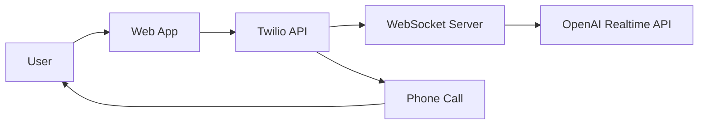

# Welcome to AI Phone Screen

**AI Phone Screen** is an open-source starter project for building AI-powered calling systems using OpenAI's Realtime API and Twilio.

## 🎯 What You Can Build

This starter gives you everything needed to create:

- **AI Interview Practice Systems** - Mock phone interviews with AI
- **Customer Service Bots** - Automated phone support agents  
- **Appointment Schedulers** - AI agents that handle booking calls
- **Survey & Feedback Systems** - Automated phone surveys
- **Lead Qualification** - AI agents for sales calls

## 🏗️ Architecture Overview

The system consists of two main components:

- **📱 Web App** (Next.js) - Frontend for call management and configuration
- **🔌 WebSocket Server** (Express) - Handles Twilio ↔ OpenAI Realtime API connection



## 🚀 Quick Start

### Prerequisites

- Node.js 18+
- Twilio Account with regional phone numbers
- OpenAI API Key  
- PostgreSQL Database (via Neon)

### 3-Terminal Setup

```bash
# Terminal 1: Start ngrok
ngrok http 8081

# Terminal 2: Start websocket server
cd websocket-server && npm run dev

# Terminal 3: Start webapp
cd webapp && npm run dev
```

Your AI calling system will be running at `http://localhost:3000`!

**⚠️ Important:** Both components need the **same ngrok HTTPS URL** in their environment files!

## 📚 Documentation Structure

### 🚀 Getting Started
Learn how to set up your development environment and configure all the necessary services.

- **[Environment Setup](getting-started/environment-setup)** - Complete configuration guide for both components

### 🏗️ Architecture  
Understand how the system works and its key features.

- **[Session Management](architecture/session-management)** - WebSocket connection handling and state management
- **[Rate Limiting](architecture/rate-limiting)** - Abuse protection with graceful message delivery
- **[Security](architecture/security)** - Cloudflare Turnstile bot protection system

### ⚙️ Configuration
Detailed guides for specific configuration needs.

- **[NeonDB Setup](configuration/neondb-setup)** - Persistent rate limiting database configuration

### 🚀 Deployment
Production deployment guides and automation.

- **[Deployment Guide](deployment)** - General deployment instructions
- **[Vercel Integration](deployment/vercel-integration)** - PR preview automation setup

### 🛠️ Development
Guidelines and workflows for contributors.

- **[Development Workflow](development/workflow)** - Contribution guidelines and development process

## 🌟 Key Features

✅ **Multi-Region Support** - US, Australia, India phone numbers with automatic fallback  
✅ **Real-time AI Conversations** - OpenAI Realtime API integration with function calling  
✅ **Session Management** - Proper cleanup and state handling between calls  
✅ **Rate Limiting** - Built-in abuse protection with graceful message delivery  
✅ **Human Verification** - Cloudflare Turnstile integration (optional)  
✅ **Database Integration** - Persistent storage with PostgreSQL via Neon  
✅ **PR Preview Environments** - Automatic deployment for testing  
✅ **Comprehensive Documentation** - Detailed setup and architecture guides  

## 🔄 Supported Regions

| Region | Flag | Country Code | Requirements |
|--------|------|--------------|---------------|
| United States | 🇺🇸 | +1 | Required (fallback) |
| Australia | 🇦🇺 | +61 | Optional |
| India | 🇮🇳 | +91 | Optional |

**Smart Fallback**: If regional numbers aren't configured, the system automatically uses the US number as fallback.

## 🛡️ Security Features

- **Rate Limiting**: IP-based and phone number-based protection
- **Bot Protection**: Optional Cloudflare Turnstile verification
- **Environment-based**: Different security levels for development vs production
- **Token Management**: 30-minute session tokens with automatic cleanup

## 🎬 Getting Started

1. **[Quick Start Guide](quick-start)** - Get up and running in minutes
2. **[Environment Setup](getting-started/environment-setup)** - Complete configuration walkthrough
3. **[Customization](customization)** - Adapt the AI for your specific use case
4. **[Deployment](deployment)** - Deploy to production with confidence

## 🤝 Contributing

We welcome contributions! See our [Development Workflow](development/workflow) for:

- Branch strategy and commit conventions
- Code quality standards and testing
- PR review process and deployment
- Best practices and troubleshooting

## 🆘 Need Help?

- **[Troubleshooting Guide](troubleshooting)** - Common issues and solutions
- **[Environment Setup](getting-started/environment-setup)** - Step-by-step configuration
- **[GitHub Issues](https://github.com/acedit-ai/phone-screen/issues)** - Report bugs or request features
- **[GitHub Discussions](https://github.com/acedit-ai/phone-screen/discussions)** - Community support

## 📄 License

This project is licensed under the MIT License - see the [LICENSE](https://github.com/acedit-ai/phone-screen/blob/main/LICENSE) file for details.
