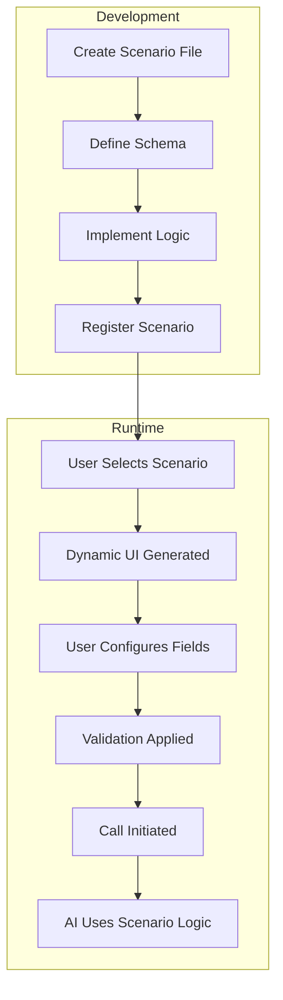

# Scenario System Overview

The AI-Powered Call Practice System is built around a **plugin-based scenario architecture** that makes it easy to create custom call simulations for any domain or use case.

## 🎯 What is a Scenario?

A **scenario** is a self-contained plugin that defines:

- **Configuration Fields**: What information users need to provide
- **Voice Options**: Available AI voices for the scenario
- **Instructions**: How the AI should behave during the call
- **Greeting**: The opening message when the call starts
- **Validation**: Rules for user input

## 🏗️ Architecture Benefits

### 🔌 Plugin-Based Design
- **Modular**: Each scenario is completely independent
- **Extensible**: Add new scenarios without touching core code
- **Maintainable**: Changes to one scenario don't affect others
- **Testable**: Each scenario can be tested in isolation

### 🌍 Domain Agnostic
- **Not Just Interviews**: Build any type of call simulation
- **Flexible Fields**: Support text, dropdowns, numbers, booleans
- **Custom Validation**: Define your own input rules
- **Dynamic UI**: Frontend adapts automatically to any scenario

### 🚀 Developer Friendly
- **TypeScript Support**: Full type safety throughout
- **Hot Reloading**: Changes appear instantly during development
- **Auto-Discovery**: New scenarios are automatically detected
- **Rich Documentation**: Comprehensive guides and examples

## 🎭 Built-in Scenarios

### 💼 Job Interview Practice
Perfect for practicing technical and behavioral interviews:
- **Job Title**: The position you're applying for
- **Company**: Target company name
- **Job Description**: Paste the full job posting
- **Voice Options**: Professional interviewer personas

### 📞 Customer Service Training
Practice handling customer inquiries and complaints:
- **Company Name**: Your organization
- **Service Type**: Product support, billing, technical help
- **Difficulty Level**: Easy, moderate, challenging scenarios
- **Voice Options**: Various customer personality types

### 🏥 Medical Consultation (Example)
Healthcare communication training:
- **Specialty**: Cardiology, pediatrics, general practice
- **Patient Type**: New patient, follow-up, emergency
- **Scenario Complexity**: Routine, complex, sensitive
- **Voice Options**: Different patient demographics

### 🎓 Language Learning (Example)
Conversational practice in different languages:
- **Language**: Spanish, French, German, etc.
- **Proficiency Level**: Beginner, intermediate, advanced
- **Topic**: Travel, business, casual conversation
- **Voice Options**: Native speaker accents

## 🔄 How It Works



### Development Flow
1. **Create**: Write a new scenario file with your logic
2. **Define**: Specify the configuration schema and fields
3. **Implement**: Add instruction generation and greeting logic
4. **Register**: Add to the scenario registry
5. **Test**: The frontend automatically detects and displays it

### Runtime Flow
1. **Selection**: User chooses a scenario from the dropdown
2. **Configuration**: UI dynamically generates fields based on schema
3. **Validation**: Real-time validation ensures proper input
4. **Execution**: Call starts with scenario-specific AI behavior

## 🛠️ Core Components

### Scenario Registry
Central hub that manages all available scenarios:
- **Auto-Discovery**: Automatically finds and loads scenarios
- **Type Safety**: Ensures all scenarios follow the correct interface
- **Error Handling**: Graceful fallbacks for missing scenarios

### Dynamic Frontend
React components that adapt to any scenario:
- **Field Rendering**: Automatically generates appropriate input fields
- **Validation Display**: Shows real-time validation errors
- **Voice Selection**: Displays scenario-specific voice options

### Session Management
Handles the lifecycle of scenario-based calls:
- **Configuration Storage**: Maintains scenario state during calls
- **Instruction Generation**: Creates AI prompts based on user input
- **Greeting Management**: Delivers scenario-specific opening messages

## 🎨 Customization Levels

### 1. Configuration Only
Use existing scenarios with different settings:
```typescript
// No code needed - just configure through the UI
```

### 2. Field Customization
Modify existing scenarios by adding/removing fields:
```typescript
// Extend existing scenario with new fields
const customJobInterview = {
  ...jobInterviewScenario,
  schema: {
    ...jobInterviewScenario.schema,
    fields: [
      ...jobInterviewScenario.schema.fields,
      { key: 'salary', label: 'Expected Salary', type: 'text' }
    ]
  }
};
```

### 3. Full Custom Scenarios
Build completely new scenarios from scratch:
```typescript
// Create entirely new scenario types
export const therapySessionScenario: CallScenario = {
  id: 'therapy-session',
  name: 'Therapy Session Practice',
  // ... full implementation
};
```

## 📈 Scaling Considerations

### Performance
- **Lazy Loading**: Scenarios are loaded on-demand
- **Caching**: Schema and configuration are cached efficiently
- **Minimal Bundle**: Only active scenarios are included in builds

### Maintenance
- **Version Control**: Each scenario can be versioned independently
- **Backward Compatibility**: Old configurations continue to work
- **Migration Support**: Built-in tools for updating scenario formats

### Team Development
- **Parallel Development**: Teams can work on different scenarios simultaneously
- **Code Ownership**: Clear boundaries for scenario maintenance
- **Testing Isolation**: Scenarios can be tested independently

## 🚀 Getting Started

Ready to create your first scenario? Check out our step-by-step guides:

- **[Creating Your First Scenario](./creating-scenarios.md)** - Complete walkthrough
- **[Scenario API Reference](./api-reference.md)** - Detailed interface documentation
- **[Best Practices](./best-practices.md)** - Tips for building great scenarios
- **[Example Scenarios](./examples.md)** - Real-world implementations

## 💡 Use Case Ideas

The scenario system is perfect for:

- **Training Simulations**: Customer service, sales calls, support
- **Educational Tools**: Language learning, interview prep, public speaking
- **Healthcare**: Patient communication, medical consultations
- **Business**: Negotiation practice, client meetings, presentations
- **Personal Development**: Confidence building, communication skills

The only limit is your imagination! 🚀 